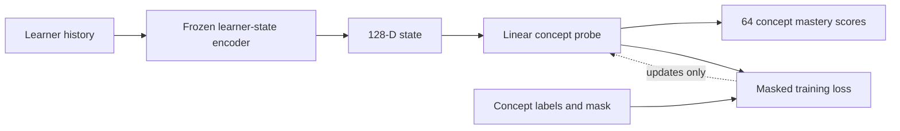
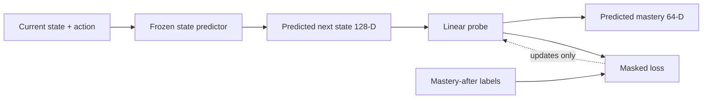

# Shared concept vocabulary

Current vocabulary: `configs/concepts/concept_vocabulary_v2.json`

The vocabulary maps task-specific stages and learning objectives onto stable concepts that
can be compared across tasks. Version 2 defines exactly 64 generic machine-learning
concepts spanning problem formulation, data, features, learning paradigms, model families,
training, evaluation, deployment, and advanced ML topics. The ontology is independent of
the three tasks currently present in LEAP; task-specific information exists only in the
separate stage and objective mappings.

Mappings are multi-label. For example:

```text
sentiment / tfidf_vectorization
  -> feature_preprocessing
  -> feature_representation
  -> feature_alignment
  -> preprocessing_leakage_prevention
  -> text_vectorization

cnn / normalize_split
  -> feature_preprocessing
  -> scaling_and_normalization
  -> train_test_separation
```

`ConceptVocabulary` validates the ontology, retrieves concepts for a stage or learning
objective, and encodes concept IDs as a 64-D multi-hot vector.

## What the concept modules do

### `vocabulary.py`

Loads and validates the 64-concept ontology. It translates task-specific stages and
learning objectives into shared concept IDs and can produce a 64-D active-concept vector.

```text
tfidf_vectorization → feature_preprocessing + text_vectorization + ...
```

### `labels.py`

Joins instructional actions with learner observations. It uses the action's learning
objectives to determine which concepts were tested and uses the response score as weak
mastery evidence. For every transition it calculates mastery immediately before and after
the response without using future interactions.

### `probe_data.py`

Loads the trained action-conditioned learner-state model and keeps it frozen. It encodes
each learner's pre-action history into a 128-D state, joins that state with its
`mastery_before` label, and creates learner-separated training, validation, and test data.

### `probe.py`

Defines the small linear model:

```text
128-D learner state → linear layer → 64 concept mastery logits
```

It also defines the masked loss, which trains only on concepts for which the learner has
previous evidence.

### `probe_training.py`

Trains and evaluates the probe, saves the best-validation checkpoint, reports per-concept
support and error, and compares the probe against a smoothed mean-mastery baseline.

The command-line scripts provide the complete workflow:

```text
prepare_concept_labels.py → concept_labels.jsonl
train_probe.py            → trained probe + metrics
```

Version 1 remains available for reproducibility. Version 2 is the current ontology. Many
of its concepts do not yet appear in the tutoring data and therefore cannot yet receive
meaningful learned mastery estimates. The ontology should be reviewed when new tasks or
instructor-authored labels become available; it is not evidence that these concepts are
already present in the learned 128-D learner state.

## Concept labels

Generate transition-level labels with:

```bash
python scripts/concepts/prepare_concept_labels.py
```

For each transition, the output stores active concept IDs and indices, direct response
evidence, and 64-D mastery-before and mastery-after vectors. Mastery is currently the
running mean response score for each concept within a learner session. Separate masks
distinguish unseen concepts from observed zero mastery.

These are weak supervision labels: correctness on one tutoring question is evidence about
its mapped concepts, not a direct measurement of knowledge.

The recorded experiment export contains 281 transition labels. Twenty-three of the 64 concepts have
at least one evidence record; 41 concepts are defined by the ontology but unobserved in the
current tasks.

## Probe V1: current learner states



The learner-state encoder remains frozen. Training updates only the linear probe, and the
mask prevents unseen concepts from contributing to the loss.

Train the probe with:

```bash
python scripts/concepts/train_probe.py
```

Probe V1 freezes the 100-epoch action-conditioned learner-state model and learns only a
linear `128 -> 64` decoder. It pairs each pre-action state with `mastery_before`, so the
current response never leaks into its label. Rows without prior concept evidence are
excluded.

| Split | Supervised states |
|---|---:|
| Train | 227 |
| Validation | 5 |
| Test | 42 |

The best checkpoint occurred at epoch 7 with validation BCE 0.5947. On the held-out test
learner, the probe obtained BCE 0.5216 and MAE 0.1765 over 336 observed concept values. A
Laplace-smoothed training-mean baseline obtained BCE 0.6077 and MAE 0.1249.

The probe improves BCE but not MAE, so the result is mixed and does not establish reliable
concept decoding. The validation set contains only five states and many ontology concepts
are unobserved. More learners and concept-targeted interactions are required before using
probe outputs as trusted mastery estimates.

- Probe configuration: `configs/concepts/probe_v1.json`
- Best probe: `outputs/concepts/checkpoints/probe_v1/best_validation.pt`
- Epoch metrics: `outputs/concepts/metrics/probe_v1.jsonl`
- Test metrics: `outputs/concepts/metrics/probe_v1_test.json`

## Probe V2: predicted next states

Probe V2 matches the planning pipeline:



The recorded action-conditioned model generates each predicted next state. The target is
the learner's `mastery_after` vector after the recorded response. Both the state model and
action-conditioned predictor stay frozen; only the probe is trained.

```bash
python scripts/concepts/train_probe.py --config configs/concepts/probe_v2.json
```

| Metric | Probe V2 | Smoothed mean baseline |
|---|---:|---:|
| Test BCE | 0.6232 | 0.6100 |
| Test MAE | 0.2773 | 0.1247 |

The best checkpoint occurred at epoch 1. Probe V2 does not beat the baseline, so its 64-D
mastery output is currently an experimental interface rather than a validated estimate.
It is nevertheless wired into `OneStepPlanner`, which can now return concept mastery for
every candidate predicted state and for the selected action.

- Probe V2 configuration: `configs/concepts/probe_v2.json`
- Best probe: `outputs/concepts/checkpoints/probe_v2/best_validation.pt`
- Test metrics: `outputs/concepts/metrics/probe_v2_test.json`
